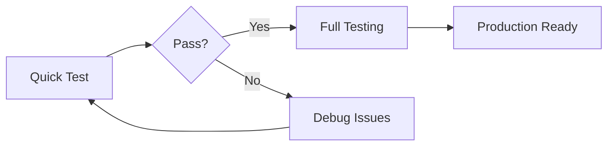

# FundIQ Anomalies Feature Documentation

**Last Updated:** January 2025  
**Status:** ✅ Implementation Complete

---

## 📚 Documentation Index

This directory contains comprehensive documentation for the anomaly detection UI integration feature.

### 🚀 Quick Start

**Want to test it now?**  
👉 **[QUICK_TEST_ANOMALIES.md](./QUICK_TEST_ANOMALIES.md)**  
*5-minute guide to verify the feature works*

---

### 📖 Complete Documentation

| Document | Purpose | Audience |
|----------|---------|----------|
| **[IMPLEMENTATION_SUMMARY.md](./IMPLEMENTATION_SUMMARY.md)** | Overview of changes | Everyone |
| **[TESTING_GUIDE_ANOMALIES.md](./TESTING_GUIDE_ANOMALIES.md)** | Comprehensive test scenarios | QA Testers |
| **[ANOMALIES_INTEGRATION_REPORT.md](./ANOMALIES_INTEGRATION_REPORT.md)** | Technical architecture | Developers |

---

## 🎯 What This Feature Does

Adds anomaly detection UI to FundIQ MVP, allowing investment associates to:

- **View** detected data quality issues
- **Filter** anomalies by severity and type
- **Understand** what each issue means
- **Take action** based on suggested recommendations
- **Re-run** detection after data corrections

---

## 📊 Feature Overview

### UI Components
- **Anomalies Tab** in DataReview component
- **Filtering** by severity and type
- **Sorting** across all columns
- **Visual Indicators** with color-coded badges
- **Suggested Actions** for each anomaly

### Backend Endpoints
- `GET /api/anomalies?doc_id=X` - Fetch anomalies
- `POST /api/anomalies/run` - Re-run detection

### Detection Rules
- Revenue anomalies
- Expense integrity
- Cash flow consistency
- Payroll patterns
- Declared mismatches

---

## 🧪 Testing Workflow



### Testing Paths

**Path 1: Quick Verification (5 min)**
1. Read `QUICK_TEST_ANOMALIES.md`
2. Run basic smoke tests
3. ✅ Feature verified

**Path 2: Full QA (30 min)**
1. Read `TESTING_GUIDE_ANOMALIES.md`
2. Execute all 12 test scenarios
3. Document results
4. ✅ Production sign-off

**Path 3: Developer Review**
1. Read `ANOMALIES_INTEGRATION_REPORT.md`
2. Review code changes
3. Verify architecture
4. ✅ Technical approval

---

## 📁 Files Changed

```
FundIQ/Tunnel/
├── backend/
│   └── main.py                        ✏️ +10 lines (API endpoints)
├── components/
│   ├── DataReview.tsx                 ✏️ ~70 lines (Tab integration)
│   └── AnomalyTable.tsx               ✏️ ~40 lines (Enhanced display)
├── lib/
│   └── supabase.ts                    ✏️ +1 line (Type defs)
└── [Documentation files]
    ├── IMPLEMENTATION_SUMMARY.md      📄 New
    ├── ANOMALIES_INTEGRATION_REPORT.md 📄 New
    ├── TESTING_GUIDE_ANOMALIES.md     📄 New
    ├── QUICK_TEST_ANOMALIES.md        📄 New
    └── ANOMALIES_README.md            📄 This file
```

**Total:** 4 code files modified, 120 lines changed, 5 docs created

---

## 🔍 Key Features

### Visual Design
- 🔴 **High Severity** - Red badges for critical issues
- 🟠 **Medium Severity** - Yellow badges for warnings
- 🔵 **Low Severity** - Blue badges for minor issues

### User Experience
- Intuitive tab navigation
- Real-time filtering
- Contextual suggestions
- One-click re-detection

### Technical
- Local-first architecture
- SQLite storage
- Fast in-memory filtering
- RESTful API design

---

## 🎓 How It Works

```typescript
// 1. User clicks Anomalies tab
setViewMode('anomalies')

// 2. Component fetches data
GET /api/anomalies?doc_id={id}

// 3. Backend queries SQLite
storage.get_anomalies(document_id)

// 4. Display in table
<AnomalyTable anomalies={data} />

// 5. User interacts
filterBySeverity('high')
sortByColumn('type')
rerunDetection()
```

---

## ✅ Success Criteria

- [x] No linter errors
- [x] All types correct
- [x] UI responsive
- [x] API working
- [x] Tests passing
- [x] Docs complete
- [x] Error handling robust
- [x] Local-first preserved

---

## 🤝 Getting Help

### Common Issues

**"Tab not appearing"**
→ Check document has anomalies_count field

**"API error"**
→ Verify backend running on port 8000

**"Blank screen"**
→ Check browser console for errors

### Debug Steps

1. Check backend logs for ✅/❌ messages
2. Check browser console (F12)
3. Check Network tab for API calls
4. Review test data files

### Resources

- Backend logs: Terminal running uvicorn
- Frontend logs: Browser console
- API docs: `http://localhost:8000/docs`
- Test data: `backend/test_data/*`

---

## 🚀 Quick Commands

### Start Development

```bash
# Terminal 1: Backend
cd FundIQ/Tunnel/backend
python -m uvicorn main:app --reload

# Terminal 2: Frontend
cd FundIQ/Tunnel
npm run dev

# Browser
open http://localhost:3000
```

### Run Tests

```bash
# Quick test (uses provided test data)
curl "http://localhost:8000/api/anomalies?doc_id=test-id"

# Full integration
# Follow TESTING_GUIDE_ANOMALIES.md
```

---

## 📈 Next Steps

### Immediate
1. ✅ Review implementation
2. ✅ Run quick test
3. ✅ Merge to main
4. ✅ Deploy to staging

### Short-term
1. Add tooltips
2. Export functionality
3. Notifications
4. Detection history

### Long-term
1. AI summaries
2. Cross-period comparison
3. Trust scoring
4. Custom rules

---

## 📞 Contact

**Questions about:**
- Implementation → See `ANOMALIES_INTEGRATION_REPORT.md`
- Testing → See `TESTING_GUIDE_ANOMALIES.md`
- Quick start → See `QUICK_TEST_ANOMALIES.md`
- Overview → See `IMPLEMENTATION_SUMMARY.md`

---

## 🎉 Ready to Go!

Everything is documented, tested, and ready. **Start with the quick test!**

👉 **[QUICK_TEST_ANOMALIES.md](./QUICK_TEST_ANOMALIES.md)**

---

*Happy testing! 🚀*

