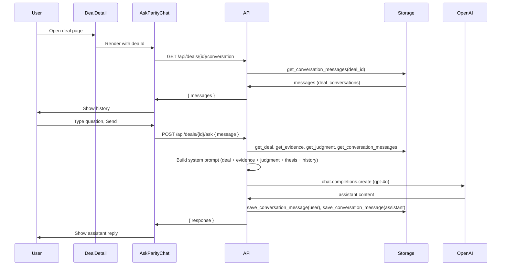

# Ask Parity — Build and How It Works

Ask Parity is a **deal-scoped AI chat**: the user talks to an AI (Parity) in the context of a single deal (company, evidence, judgment, thesis). It is implemented as follows.

## Architecture

## Frontend

| Piece | Location | Role |
|-------|----------|------|
| **UI** | `components/AskParityChat.tsx` | Chat box: message list, input, Send. Loads history on mount, sends each user message to the API, appends user + assistant messages. |
| **Placement** | `components/DealDetail.tsx` | Renders `<AskParityChat dealId={dealId} />` on the deal detail page (below evidence, above Run Judgment). |

**Flow**

1. On mount, `AskParityChat` calls `GET /api/deals/{dealId}/conversation` (via `fetchApi`, so with auth).
2. User types and submits; component sends `POST /api/deals/{dealId}/ask` with `{ message }`.
3. On success, it appends the assistant reply to local state; on error it shows the error and removes the optimistic user message.

## Backend

| Piece | Location | Role |
|-------|----------|------|
| **Routes** | `backend/routes/deals.py` | `GET /deals/{deal_id}/conversation`, `POST /deals/{deal_id}/ask` (mounted under `/api`). Both require `get_current_user` (JWT). |
| **Storage** | `backend/local_storage.py` (SupabaseStorage) | `save_conversation_message(deal_id, role, content)`, `get_conversation_messages(deal_id, limit=10)` against table `deal_conversations`. |
| **DB** | `migrations/add_deal_conversations.sql` | Table `deal_conversations` (id, deal_id, role, content, created_at). |

**Ask flow (POST /ask)**

1. Validate JWT and deal ownership.
2. Load deal, evidence (types), judgment (scores, explanations, missing evidence), thesis (investment focus, thresholds), and last 10 conversation messages.
3. Build a long system prompt describing: deal context, evidence available (yes/no), judgment summary (or “Not yet run”), thesis, and conversation history in block format (USER: / ASSISTANT (Parity):). Rules include: no invented data, if judgment not run say so, concise answers, no investment recommendations.
4. Call OpenAI `gpt-4o` with `[system, user_message]` (history is in the system prompt).
5. Save user message and assistant reply to `deal_conversations`; return `{ response }`.

**Requirements**

- **Auth**: Valid Supabase JWT; user must own the deal.
- **Storage**: Supabase with `deal_conversations` table (and `deals`, `evidence`, `judgment`, `thesis`).
- **OpenAI**: `OPENAI_API_KEY` set; if missing, API returns 503 “Ask Parity is unavailable (OPENAI_API_KEY not set).”

## Data

- **Conversation**: Stored in `deal_conversations`: `deal_id`, `role` (‘user’ | ‘assistant’), `content`, `created_at`. Fetched oldest-first for display; last 10 included in the LLM system prompt.
- **Context**: Deal metadata, evidence types (financials, bank statements, governance), full judgment result (readiness, alignment, dimension scores, kill signals, explanations, suggested missing evidence), and thesis (focus, min_revenue, etc.) are all passed in the system prompt so Parity can answer in context.

## How to Test

1. **API (auth + routing)**  
   Run `./scripts/test-ask-parity.sh` (or call the endpoints with curl). Expect: 401 without token; 400 for POST with empty message; with valid token and real deal id, 200 and conversation/response (or 503 if OpenAI key missing).

2. **E2E in app**  
   Log in → open a deal → scroll to “Ask Parity” → load conversation (or empty) → send a question. Before judgment: Parity should say judgment has not been run when asked about scores. After judgment: Parity can explain scores and evidence.

3. **DB**  
   Ensure migration `add_deal_conversations.sql` has been applied in Supabase so `deal_conversations` exists and is linked to `deals(id)`.
